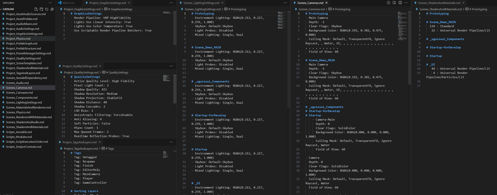
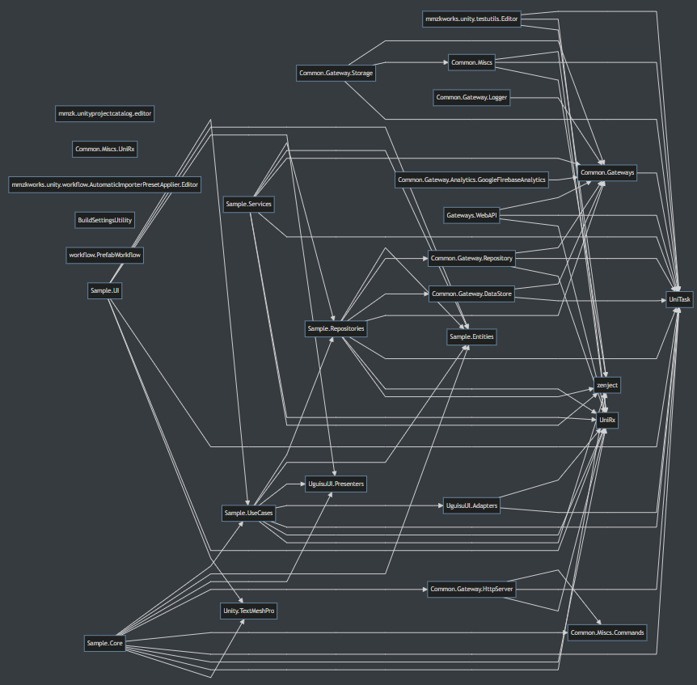

Unityのプロジェクトファイルの全体構成・大枠をレポートにすることで全体把握しやすくするツールです。

# 概要

## 対象としている課題

Unityのプロジェクトではスクリプト、グラフィック、音、物理など多様な要素を扱います。
それらの設定はプロジェクト内の各所に散りばめられていて、全体像がどうなっているかの把握にはある程度の手間を要します。

## 解決策

プロジェクトの最新の構成をより俯瞰的に見る方法があれば把握が捗るのではないか？
このPackageでは、Unity Editor上の１つのコマンドでUnityの各種設定・Scene・Assetの一覧、関係性、主要な設定値をmarkdown形式のレポートファイルに一括出力します。
知りたい観点別のレポートをまとめて見られることで、プロジェクト構成を把握しやすくします。

# 使いかた

## インストール

* upm

  * Unity Editorで Window/Package Manager を開き、Add package from git URLで以下をインストールします。

  * ```
    https://github.com/uisawara/UnityProjectCatalog.git
    ```

  * 依存モジュールとして Newtonsoft.Json を使っています。プロジェクトにインストールされていない場合は導入してください。

    * (既存プロジェクトでは様々な方法でインストール済になっていることが多いと感じていて、それと競合するのを避ける目的であえて同梱・Dependenciesに入れていません)

## 基本

- Unity Editorで Menu/Tools/Generate project catalog を実行する。
- コマンドが終了すると <project-folder>/catalog/ にプロジェクト構成のレポートが出力されます。
- レポートは markdown+mermaid形式(.md) で出力されます。

### レポート種類

* [/Editor/Reporters](https://github.com/uisawara/UnityProjectCatalog/tree/main/Editor/Reporters) フォルダのファイル一式がレポートの種類です。
* 幾つかの切り口でのレポートを用意しています。
  * スコープ別
    * Project
      * Project全体の設定情報
    * Presets
      * Preset設定情報
    * Templates
      * SceneTempaltes情報
    * Scene
      * Projectに含まれる各Sceneの情報
    * Assets
      * Projectに含まれるPrefabの情報
  * 機能別
    * Scripts
    * Graphics
    * Audio
    * Physics
    * Canvas
    * Prefab

## オプション

- Scripts_Asmdefsレポートではasmdef除外設定ができます。
  - Assets/Settings/にUnityProjectCatalogSettingsを配置、Excluded Assembliesに設定することで出力から除外されます。
  - 設定ファイルは ProjectWindowから右クリックメニューのCreate/Settings/Unity Project Catalog Settings で作成できます。

- 一部のレポートはデフォルトでは無効になっているため設定が必要です。
  - PostProcessingVolumes
    - ScriptingDefineSymbolsに UNITYPROJECTCATALOG_USE_POSTPROCESSING を設定してください。

  - Zenject
    - ScriptingDefineSymbolsに UNITYPROJECTCATALOG_USE_ZENJECTを設定してください。

  - NuGet For Unity
    - Assets/packages.config ファイルがあると自動でレポート対象にします。


# 利用例

## VSCoreを使ったGraphics構成の閲覧

* VSCode, typora等でCatalogフォルダを開き、左から順にProject系レポート、Asset系レポート、Scene系レポートと並べて見ると設定の親子関係が見えやすいです。
  * 例えば：
    * グラフィックス関連
      * Project_GraphicsSettings
      * Project_QualitySettings
      * Project_TagsAndLayers
      * Project_ShadersAndMaterials
      * Scenes_MaterialsAndRenderers
      * Scenes_RenderersWithMaterials
      * Scenes_ShadersAndMaterials
    * スクリプト関連s
      * Scripts_Modules
      * Scripts_Asmdefs
      * Scripts_ScriptExecutionOrder
      * Scripts_ZenjectContexts （オプション）
  * 例：
  * 
    * 左からGraphisSettings, QualitySettings, TagsAndLayers, SceneCameras, SceneLightings, Scene (using)Shaders を並べたもの。
    * 全体としてどんな設定が効いているか、複数シーンでどんな構成が組まれているかが見られる。

## スクリプト構成の把握

* 
* Assembly Dependencyでasmdef間の依存関係が把握できる。
* Scripts_Modulesレポートでは Git Submodules, NuGet Packages, UnityPackages の利用モジュールをまとめて見られる。

# 補足

* このPackageは積極的にChatGPT等を利用して作成されています。
* レポートを改変したい場合はupmを通さずプロジェクトに直接ファイルを入れていただくか、git submoduleでの組み込みをするのがいいと思います。
