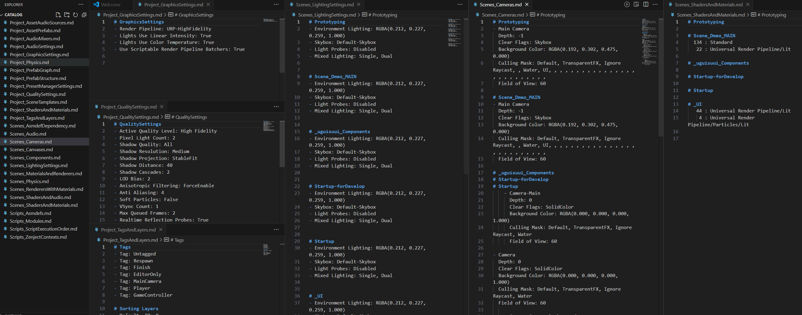
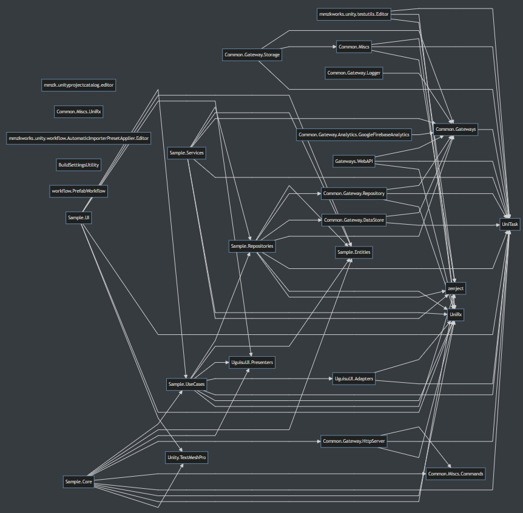

**[Machine translated]**

# Unity Project Catalog

This tool helps you grasp the overall structure of Unity project files by reporting on them.

## Overview

### Issues Addressed

In Unity projects, various elements such as scripts, graphics, audio, and physics are managed. The settings for these elements are scattered throughout the project, making it somewhat laborious to understand the overall picture.

### Solution

Wouldn't it be easier to understand the latest configuration of the project with a more comprehensive view? This package allows you to output a list of various settings, scenes, assets, relationships, and key configuration values from Unity Editor into a markdown report file with a single command. By gathering reports on specific aspects you wish to know, you can more easily grasp the project structure.

## How to Use

### Installation

* **UPM**

  * Open **Window/Package Manager** in Unity Editor and install the package from git URL using the following:

  ```
  https://github.com/uisawara/UnityProjectCatalog
  ```

  * It uses `Newtonsoft.Json` as a dependency module. Please install it if it's not already in your project.

    * (I feel that existing projects often have it installed in various ways, so to avoid conflicts, it is intentionally not included in the package's dependencies.)

### Basics

- Run **Menu/Tools/Generate project catalog** in Unity Editor.
- Once the command finishes, a report of the project structure will be output to `<project-folder>/catalog/`.
- The report will be output in markdown + mermaid format (.md).

### Types of Reports

* The files in the `/Editor/Reporters` folder represent the types of reports.
* Several types of reports are prepared based on various perspectives.
  * By Scope:
    * **Project**
      * Configuration information for the entire project.
    * **Presets**
      * Preset information for the entire project.
    * **Templates**
      * Scene template information for the entire project.
    * **Scene**
      * Information about each scene included in the project.
    * **Assets**
      * Information about prefabs included in the project.
  * By Functionality:
    * Scripts
    * Graphics
    * Audio
    * Physics
    * Canvas
    * Prefab

## Options

- In the `Scripts_Asmdefs` report, you can set exclusions for asmdef.
  - Place `UnityProjectCatalogSettings` in `Assets/Settings/` and configure it in the `Excluded Assemblies` to exclude from output.
  - You can create the settings file from the right-click menu in Project Window by selecting **Create/Settings/Unity Project Catalog Settings**.

- Some reports are disabled by default and require configuration.
  - **PostProcessingVolumes**
    - Please set `UNITYPROJECTCATALOG_USE_POSTPROCESSING` in `ScriptingDefineSymbols`.

  - **Zenject**
    - Please set `UNITYPROJECTCATALOG_USE_ZENJECT` in `ScriptingDefineSymbols`.

  - **NuGet For Unity**
    - If there is an `Assets/packages.config` file, it will automatically be included in the report target.

## Usage Examples

### Viewing Graphics Configuration Using VSCore

* Open the Catalog folder with VSCode, Typora, etc., and arrange the Project reports, Asset reports, and Scene reports from left to right to easily see the parent-child relationships of settings.
  * For example:
    * Graphics-related
      * Project_GraphicsSettings
      * Project_QualitySettings
      * Project_TagsAndLayers
      * Project_ShadersAndMaterials
      * Scenes_MaterialsAndRenderers
      * Scenes_RenderersWithMaterials
      * Scenes_ShadersAndMaterials
    * Script-related
      * Scripts_Modules
      * Scripts_Asmdefs
      * Scripts_ScriptExecutionOrder
      * Scripts_ZenjectContexts (optional)
  * Example:
  * 
    * This shows GraphicsSettings, QualitySettings, TagsAndLayers, SceneCameras, SceneLightings, Scene (using) Shaders from left to right.
    * You can see what settings are applied overall and what structure is configured across multiple scenes.

### Understanding Script Structure

* 
* You can understand the dependencies between asmdefs with Assembly Dependency.
* The `Scripts_Modules` report summarizes the modules used for Git Submodules, NuGet Packages, and Unity Packages.

## Supplement

* This package is actively created using tools like ChatGPT.
* If you wish to modify the report, it is recommended to directly place files in the project without going through UPM, or to incorporate them via git submodules.

